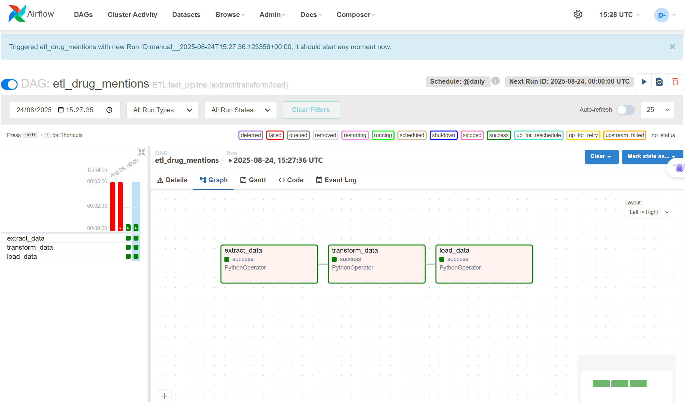
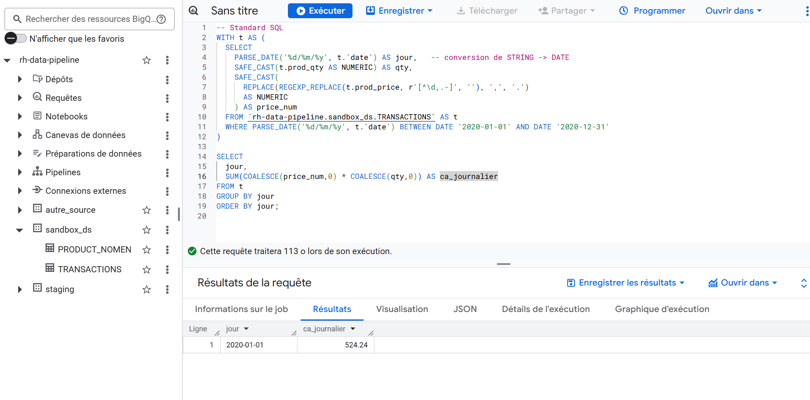
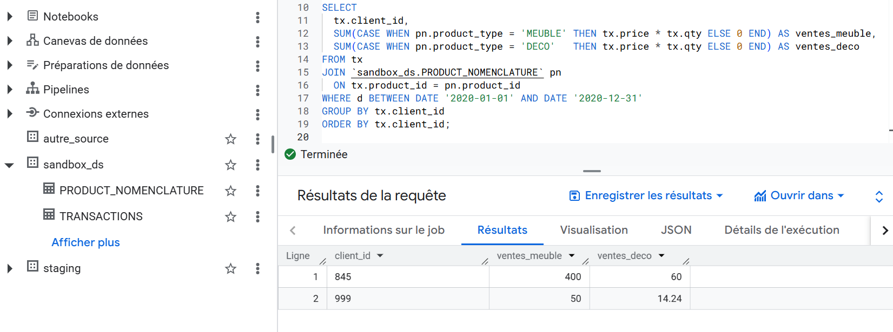

# test_pipline — ETL Drug → Publications

Projet Python **propre et modulaire** qui :
- lit `drugs.csv`, `pubmed.csv` + `pubmed.json`, `clinical_trials.csv` ;
- détecte les **mentions** de médicaments dans les **titres** ;
- produit un **JSON final groupé par code ATC** ;
- ajoute, pour chaque **journal**, la **première date**, la **dernière date** et le **nombre de publications distinctes** ;
- inclut un **traitement ad-hoc** pour trouver le journal qui mentionne le plus de **médicaments distincts**.

## Structure
```
test_pipline/
├─ src/
│   └
│       ├─ __init__.py
│       ├─ config.py            <- config centralisée (chemins, constantes)
│       ├─ io.py                <- lecture/écriture des fichiers
│       ├─ clean.py             <- fonctions de nettoyage
│       ├─ match.py             <- fonctions de matching médicaments/textes
│       ├─ aggregate.py         <- agrégation des résultats, graphe
│       └─ pipeline.py          <- pipeline principale (orchestration)
├─ tools/
│  └─ top_journal.py   # ad-hoc: top journal par nb de médicaments distincts
├─ Data/               # Fichiers src
├─ outputs/            # résultats
├─ run.py              # lance la pipeline sans installer le package
├─ requirements.txt
└─ README.md
```

## Entrées attendues (dans `Data/`)
- `drugs.csv` (colonnes : `atccode`, `drug`)
- `pubmed.csv` et/ou `pubmed.json` (colonnes : `id`, `title`, `journal`, `date`)
- `clinical_trials.csv` (colonnes : `id`, `scientific_title`→`title`, `journal`, `date`)

## Sorties (dans `outputs/`)
- `drug_publications_by_atc.json` : JSON final **par ATC** :
  ```json
  {
    "A04AD": {
      "drug": "DIPHENHYDRAMINE",
      "atccode": "A04AD",
      "pubmed": [
        {"id": 1, "title": "...", "date": "2019-01-01", "journal": "..."}
      ],
      "clinical_trials": [
        {"id": "NCT0123", "title": "...", "date": "2020-01-01", "journal": "..."}
      ],
      "journals": [
        {"journal": "Journal A", "first_date": "2019-01-01", "last_date": "2020-03-05", "n_pubs": 3}
      ]
    }
  }
  ```

## Installation
```bash
pip install -r requirements.txt
```

## Exécution de la pipeline
```bash
python run.py --data-dir Data --out-dir outputs --dayfirst
```
- `--dayfirst` : dates ambiguës interprétées **jour/mois/année** (EU). Retirez ce flag si vos sources sont US.

## Traitement ad-hoc (journal le plus couvrant)
Une fois le JSON généré :
```bash
python tools/top_journal.py --input outputs/drug_publications_by_atc.json --export-csv outputs/journal_drug_coverage.csv
```
### DAG ETL



## Réponses aux questions supplémentaires

### Gestion de grosses volumétries de données

Pour pouvoir traiter des fichiers de plusieurs To ou des millions de fichiers, la pipeline devrait évoluer ainsi :

1. **Lecture et traitement par morceaux**  
   Lire les données en *chunks* (par exemple 1 million de lignes à la fois) pour éviter de saturer la mémoire.  

2. **Formats optimisés**  
   Utiliser **Parquet** ou **Avro** au lieu de CSV/JSON : plus compacts et plus rapides à lire/écrire.  

3. **Traitement distribué**  
   Migrer vers des frameworks comme **Apache Spark**, **Dask** ou **Apache Beam** pour paralléliser le calcul sur un cluster.  

4. **Partitionnement**  
   Organiser les données par date, médicament ou source pour ne charger que les parties nécessaires.  

5. **Pipeline incrémentale**  
   Ne traiter que les **nouvelles données** à chaque exécution, et pas tout l’historique.  

6. **Optimisation des algorithmes**  
   Adapter les jointures et les recherches pour réduire la consommation mémoire et accélérer le traitement.  

7. **Infrastructure scalable**  
   Déployer la pipeline sur une infrastructure cloud ou cluster capable d’augmenter/réduire les ressources automatiquement.  

8. **Monitoring et qualité des données**  
   Ajouter des logs, des métriques et des contrôles de qualité pour détecter rapidement anomalies et erreurs.  

 En résumé : **lire par morceaux, stocker dans des formats efficaces, distribuer le calcul, traiter seulement les nouveautés, et utiliser une infrastructure qui s’adapte automatiquement.**
 
## Partie 2 Test : BigQuery (Tests SQL)

J’ai testé les requêtes directement dans **BigQuery** afin de valider la logique.

-  Le **chiffre d’affaires journalier** est correctement calculé jour par jour.  
-  La répartition des ventes **MEUBLE / DECO par client** est juste.  
-  Des captures d’écran montrent les exécutions et les résultats obtenus.

### Exécution des requêtes
  



## Partie 1 — Requêtes SQL


```sql
SELECT 
  t.date AS jour,
  SUM(t.prod_price * t.prod_qty) AS ca_journalier
FROM transactions t
WHERE t.date >= '2019-01-01'
  AND t.date <= '2019-12-31'
GROUP BY t.date
ORDER BY jour;


### 2) Ventes "MEUBLE" et "DECO" par client

SELECT 
  tr.client_id,
  SUM(CASE WHEN p.product_type = 'MEUBLE' THEN tr.prod_price * tr.prod_qty END) AS total_meuble,
  SUM(CASE WHEN p.product_type = 'DECO'   THEN tr.prod_price * tr.prod_qty END) AS total_deco
FROM transactions tr
INNER JOIN product_nomenclature p
  ON tr.prod_id = p.product_id
WHERE tr.date >= '2019-01-01'
  AND tr.date <= '2019-12-31'
GROUP BY tr.client_id
ORDER BY tr.client_id;


